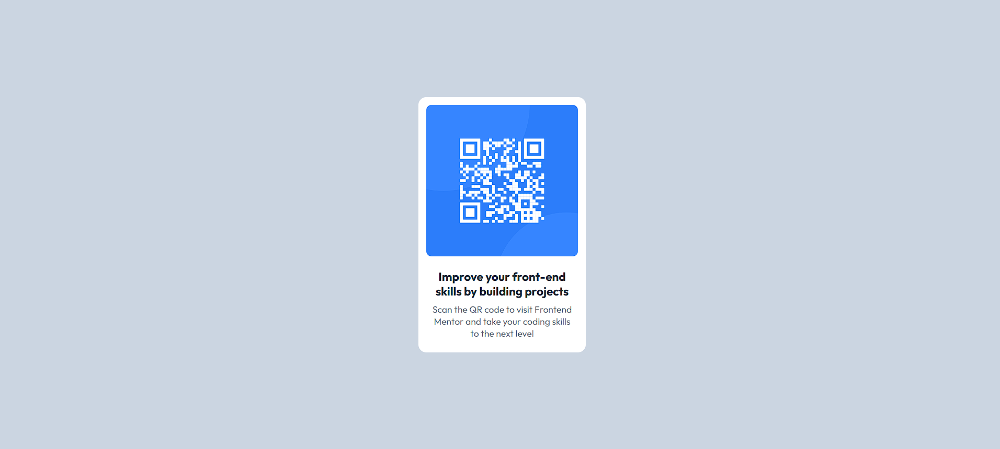

# Frontend Mentor - QR code component solution

### Screenshot

 x

### Links

- Solution URL: [Add solution URL here](https://your-solution-url.com)
- Live Site URL: [Add live site URL here](https://your-live-site-url.com)

### Built with

- Semantic HTML5 markup
- Tailwind CSS
- Flexbox

### Useful resources

- [Tailwind CSS](https://tailwindcss.com/)
- [CSS-Tricks](https://css-tricks.com/snippets/css/a-guide-to-flexbox/) - This website helps me whenever i need to use flexbox

## Author

- Website - [Yağmur Taşanyürek](https://yagmurtasanyurek.netlify.app/)
- Frontend Mentor - [@yagmurtasanyurek](https://www.frontendmentor.io/profile/yagmurtasanyurek)
